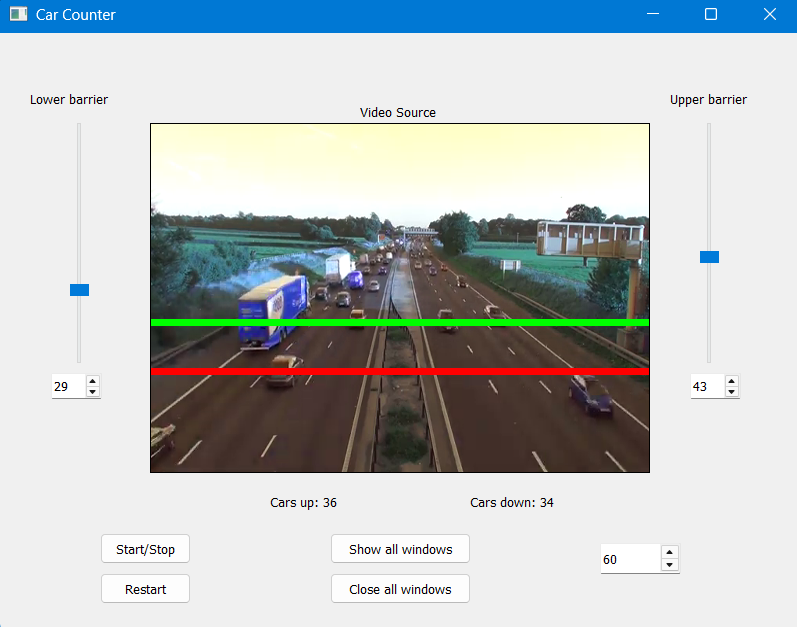

# EntregaAutopista

> **Aviso:** Este es un proyecto educativo realizado en el contexto de la universidad en 2022. El código no sigue los estándares ni las mejores metodologías de desarrollo actuales. Ha sido publicado con fines de referencia y aprendizaje.

Aplicación de escritorio para el **conteo de vehículos en video de autopista**. Utiliza sustracción de fondo con OpenCV, tracking centroidal y barreras configurables para contar vehículos que circulan en dirección ascendente y descendente.



## Características principales

- Detección de objetos mediante sustracción de fondo MOG2 (OpenCV)
- Tracking centroidal entre cuadros consecutivos con asignación de IDs únicos
- Dos barreras horizontales configurables con contadores independientes (dirección ascendente / descendente)
- Interfaz gráfica PyQt5 con visualización del video en tiempo real
- Controles de velocidad, pausa, reinicio y ajuste dinámico de barreras
- Modo debug que muestra ventanas intermedias (máscara, umbral, cierre, apertura, dilatación)
- Arquitectura basada en configuración JSON

## Prerrequisitos

- **Python 3.x**
- **Sistema operativo:** Windows, Linux o macOS
- OpenCV requiere códec de video compatible con el sistema operativo

## Instalación

1. Clona el repositorio:

```bash
git clone https://github.com/ManuelDuque/EntregaAutopista.git
cd EntregaAutopista
```

2. Instala las dependencias:

```bash
pip install -r requirements.txt
```

| Paquete       | Versión  |
| ------------- | -------- |
| PyQt5         | 5.15.7   |
| opencv-python | 4.7.0.68 |
| numpy         | 1.26.4   |

## Ejecución

```bash
# Con el video por defecto (M6MotorwayTraffic.mp4)
python ./src/main.py

# Con un video específico
python ./src/main.py path/to/video.mp4
```

> **Nota:** El video por defecto `M6MotorwayTraffic.mp4` no está incluido en el repositorio. Es necesario proporcionar un archivo de video propio.

## Configuración

La configuración se define en `src/config/ui_config.json`:

```json
{
  "ui": {
    "title": "Car Counter",
    "ui_file_path": "mainwindow.ui",
    "counter_text1": "Cars up: {0}",
    "counter_text2": "Cars down: {0}"
  },
  "video": {
    "fps": 60,
    "video_file_path": "M6MotorwayTraffic.mp4"
  },
  "barriers": {
    "upper": { "y": 35, "color": [0, 255, 0], "thickness": 5 },
    "lower": { "y": 22, "color": [255, 0, 0], "thickness": 5 }
  }
}
```

| Campo                   | Descripción                                                          |
| ----------------------- | -------------------------------------------------------------------- |
| `ui.title`              | Título de la ventana                                                 |
| `ui.counter_text1`      | Texto del contador ascendente (formato `{0}` = número)               |
| `ui.counter_text2`      | Texto del contador descendente (formato `{0}` = número)              |
| `video.fps`             | Velocidad de reproducción en cuadros por segundo                     |
| `video.video_file_path` | Ruta del archivo de video (relativa al directorio raíz del proyecto) |
| `barriers.upper`        | Barrera superior: posición Y, color RGB y grosor                     |
| `barriers.lower`        | Barrera inferior: posición Y, color RGB y grosor                     |

## Estructura del proyecto

```
EntregaAutopista/
├── mainwindow.ui              # Diseño de la interfaz (Qt Designer, 800×600)
├── requirements.txt           # Dependencias de Python
├── src/
│   ├── main.py                # Punto de entrada de la aplicación
│   ├── detector.py            # Detección de objetos (sustracción de fondo MOG2)
│   ├── tracker.py             # Tracking centroidal entre cuadros
│   ├── processor.py           # Lógica de conteo en barreras
│   ├── ui.py                  # Ventana PyQt5 y visualización de video
│   ├── utils.py               # Singleton decorator + utilidades
│   └── config/
│       └── ui_config.json     # Configuración de la aplicación
└── README.md
```

### Archivos principales

| Archivo        | Descripción                                                                                                                                                |
| -------------- | ---------------------------------------------------------------------------------------------------------------------------------------------------------- |
| `main.py`      | Punto de entrada. Crea la aplicación Qt y la ventana principal.                                                                                            |
| `detector.py`  | Clase `ObjectDetector`: aplica sustracción de fondo MOG2, operaciones morfológicas y detección de contornos para extraer bounding boxes de vehículos.      |
| `tracker.py`   | Clase `Tracker`: implementa tracking centroidal que asocia objetos detectados entre cuadros consecutivos usando distancia euclidiana (umbral: 20 píxeles). |
| `processor.py` | Clase `Processor`: calcula la dirección de movimiento y cuenta vehículos que cruzan las barreras configuradas.                                             |
| `ui.py`        | Clase `Window`: ventana PyQt5 que muestra el video procesado con las barreras superpuestas, contadores y controles de interacción.                         |
| `utils.py`     | Clase `Utils`: decorator singleton, carga de JSON y resolución de rutas.                                                                                   |

## Arquitectura

El flujo de procesamiento de cada cuadro es:

```
Video Frame
    │
    ▼
┌──────────────────┐
│ ObjectDetector   │  Sustracción de fondo MOG2 + contornos
│ .detect()        │
└────────┬─────────┘
         │ Bounding boxes [x, y, w, h, center]
         ▼
┌──────────────────┐
│ Tracker          │  Matching centroidal entre cuadros
│ .track()         │
└────────┬─────────┘
         │ Objetos rastreados con posición actual y anterior
         ▼
┌──────────────────┐
│ Processor        │  Detección de cruce de barreras
│ .process()       │  Conteo ascendente / descendente
└────────┬─────────┘
         │
         ▼
    Actualizar UI
```

Todos los componentes (`ObjectDetector`, `Tracker`, `Processor`, `Window`, `Utils`) implementan el patrón **Singleton**.

## Tecnologías

| Tecnología      | Uso                                             |
| --------------- | ----------------------------------------------- |
| Python 3        | Lenguaje de programación                        |
| PyQt5 5.15.7    | Interfaz gráfica de escritorio                  |
| OpenCV 4.7.0.68 | Procesamiento de video y visión por computadora |
| NumPy           | Operaciones matriciales (dependencia de OpenCV) |

## Autor

[ManuelDuque](https://github.com/ManuelDuque)
